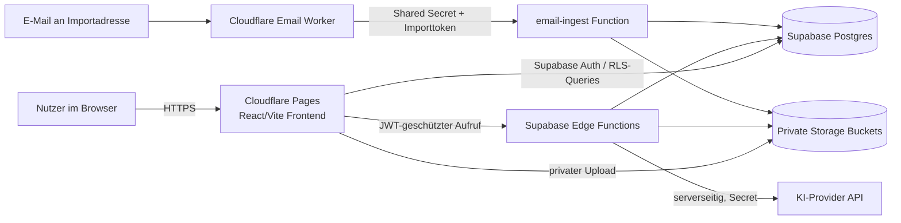

# Architektur

## Zielbild

TenderWerk Copilot trennt ein statisch auslieferbares Frontend von sicherheitskritischer Daten- und KI-Verarbeitung. Das Frontend kann über Cloudflare Pages aus GitHub gebaut werden. Supabase übernimmt Authentifizierung, mandantenbezogene Datenbank, private Dateispeicherung und Edge Functions. Ein optionaler Cloudflare Email Worker übergibt eingehende E-Mails nach Tokenprüfung an eine geschützte Edge Function.

## Systemübersicht

## Komponenten

### Frontend

- React/Vite SPA mit deutschsprachigen öffentlichen Seiten und Appbereich.
- Im sicheren Standard startet die Anwendung im synthetischen Demomodus.
- Die UI enthält Projektübersicht, Dokumentinventar, Analyse-/Fundstellenansichten, Go-/No-Go, Fristen, Lose, Nachweise, Risiken, Kalkulation, Checkliste und Freigabe.
- Der produktive Authentifizierungsanschluss verwendet Supabase Auth, sobald `VITE_DEMO_MODE=false` und die öffentlichen Supabase-Werte gesetzt sind.

### Datenbank und Auth

- `auth.users` ist die Identitätsquelle.
- `organizations` und `organization_members` bilden Mandant und Rollen ab.
- Jede fachliche Projekttabelle führt `organization_id`.
- RLS-Hilfsfunktionen prüfen Mitgliedschaft und Rollen serverseitig.
- `licenses` und `usage_events` ermöglichen begrenztes Trial-/Admin-Management ohne Zahlungsanbieter.

### Storage

Private Buckets:

- `tender-originals`: unveränderte Originaluploads und E-Mail-Anhänge.
- `tender-derived`: abgeleitete Exporte beziehungsweise künftig extrahierte Artefakte.
- `organization-evidence`: unternehmenseigene Nachweise.

Objektpfad: `<organization_id>/<tender_id oder evidence>/<uuid>-<sicherer-dateiname>`.

### Edge Functions

| Function | Zweck | Sicherheitsgrenze |
|---|---|---|
| `create-analysis-job` | Job nach Kontingentprüfung reservieren | Nutzer-JWT und Organisationsrolle |
| `process-document` | Sichere Basistextextraktion für TXT/CSV/XML; andere Formate klar markieren | Nutzer-JWT, Datei-/Mandantenprüfung |
| `analyze-tender` | Strukturierte serverseitige KI-Analyse bereits extrahierter Chunks | Nutzer-JWT, KI-Secret ausschließlich serverseitig |
| `email-ingest` | E-Mail-Anhänge nach Importtoken einer Organisation zuordnen | Shared Secret + gehashter Organisationstoken |
| `export-report` | Strukturierte Berichtsdaten für internen Export | Nutzer-JWT/RLS |
| `admin-license` | Trial-/Lizenzstatus bearbeiten | Plattformadminprüfung |

### Cloudflare Email Worker

Der Worker ist getrennt vom Kernupload. Er nimmt nur konfigurierte E-Mail-Routen entgegen, liest MIME-Anhänge, begrenzt Dateitypen/Größe und ruft `email-ingest` mit einem Worker Secret auf. Die Standardkonfiguration aktiviert keine automatische KI-Analyse; importierte Projekte erscheinen zunächst zur Nutzerprüfung.

## Fachlicher Datenfluss

1. Nutzer erstellt Unternehmen und hinterlegt Leistungen, Ausschlüsse, Region, Kapazität und Nachweise.
2. Nutzer legt Ausschreibung an und lädt Unterlagen in den privaten Originalbucket.
3. Dokumentstatus zeigt, welche Dateien auslesbar sind beziehungsweise zusätzliche Prüfung benötigen.
4. Nach Extraktion erhält die serverseitige KI nur kontrollierten Dokumentkontext; die Antwort wird per Schema validiert.
5. Strukturierte Ergebnisse werden versioniert gespeichert; jeder kritische Eintrag soll Quelle, Locator, Ausschnitt und Prüfstatus führen.
6. Die Go-/No-Go-Funktion berechnet auf Basis von Profil und Ergebnissen nachvollziehbare Scores und harte Stopps.
7. Nutzer korrigiert/bestätigt Angaben, kalkuliert Positionen und arbeitet die Checkliste ab.
8. Eine berechtigte Person gibt intern frei; die tatsächliche Einreichung bleibt manuell.

## Datenmodell-Kurzfassung

- Organisation: `profiles`, `organizations`, `organization_members`, `organization_settings`, `company_capabilities`, `licenses`.
- Dokumente und Projekte: `tenders`, `tender_files`, `document_chunks`, `email_imports`.
- Analyse: `analysis_jobs`, `analysis_runs`, `deadlines`, `lots`, `requirements`, `risks`, `line_items`.
- Bearbeitung: `calculation_items`, `checklist_items`, `go_nogo_evaluations`, `audit_logs`, `usage_events`.
- Import: `organization_import_tokens`.

## Trennung von fertigem Demoflow und Produktionsausbau

Der lokale Demoflow ist sofort testbar und zeigt die Fachoberfläche mit fiktiven Ergebnissen. Die SQL-/Function-/Worker-Struktur ist eine sichere Grundlage für die produktive Weiterentwicklung. Für einen Kundenpilot ist noch die vollständige Persistenz- und Abrufverdrahtung aller fachlichen UI-Ansichten sowie robuste Parserintegration für reale PDF/DOCX/XLSX-/ZIP-Dokumente abzuschließen und in einer Stagingumgebung zu prüfen.
